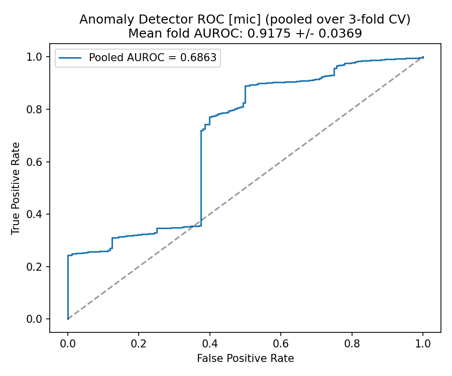
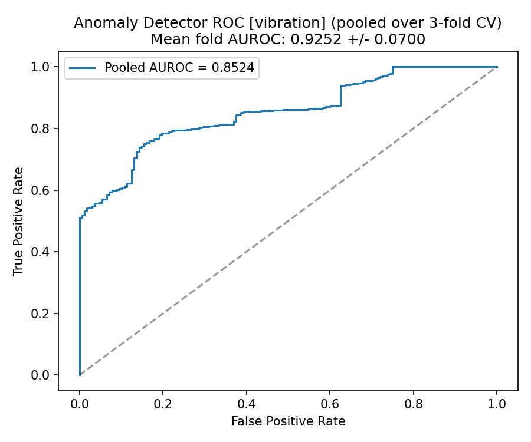
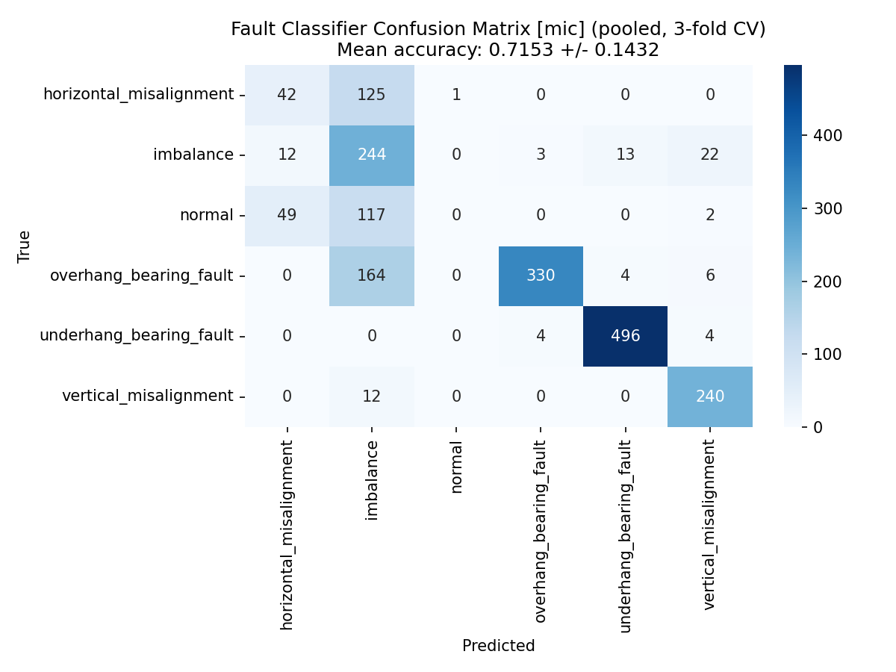
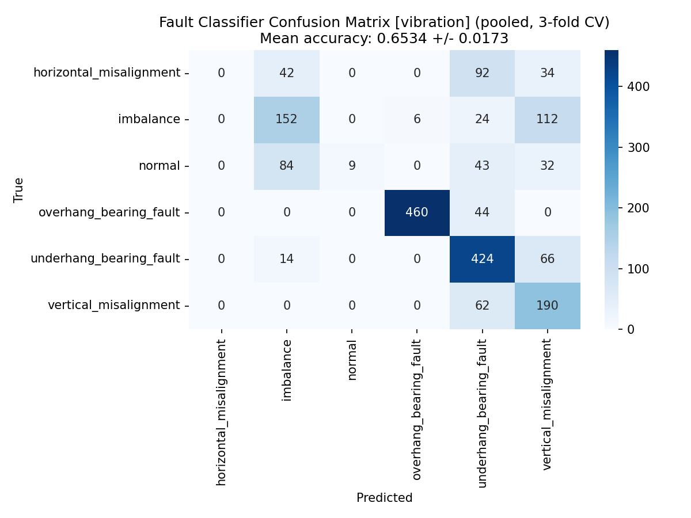

# Acoustic Predictive Maintenance of Industrial Motors and Bearings

Spectrogram-based anomaly detection and fault classification from microphone and vibration sensor data, using the MAFAULDA (Machinery Fault Database) dataset. Built for the ITSOLERA AI internship, Project 02.

## Problem

Vibration-sensor based predictive maintenance is effective but expensive to deploy per-asset, which puts it out of reach for most small and medium manufacturers. This project tests whether a single microphone, combined with a deep learning pipeline, can flag developing motor and bearing faults using sound alone, no vibration hardware required, and directly compares that approach against the traditional vibration-based baseline on the same data and pipeline.

## Dataset

[MAFAULDA](https://www02.smt.ufrj.br/~offshore/mfs/page_01.html), a real recording set from a SpectraQuest Machinery Fault Simulator. Each 5-second sequence includes 8 sensor channels; this project uses the microphone channel and one vibration channel, run through identical pipelines so results are directly comparable. Six operating states are covered: normal, imbalance, horizontal misalignment, vertical misalignment, underhang bearing fault, and overhang bearing fault.

## Approach

1. **Feature extraction** — each recording is chunked into 1-second overlapping windows and converted to log-scaled Mel-spectrograms, built separately for the microphone channel and the vibration channel.
2. **Anomaly detection** — a convolutional autoencoder is trained only on spectrograms from the "normal" class. At inference time, reconstruction error on unseen audio becomes a failure-risk score: high error means the sound deviates from the machine's healthy baseline. A separate autoencoder is trained per channel.
3. **Fault classification** — a separate CNN is trained on all six labeled classes, to identify which specific fault (bearing wear, imbalance, misalignment) is present once an anomaly is flagged. Trained and evaluated per channel.
4. **Evaluation** — ROC/AUROC for the anomaly detector (normal vs. all faults), and accuracy/F1/confusion matrix for the fault classifier, computed separately for microphone and vibration data. All train/test splits are done at the file level (not chunk level) so that overlapping windows from the same recording never leak between train and test.

## Repository structure

```
acoustic-pdm/
├── data/
│   ├── raw/            # unzipped MAFAULDA data goes here (not committed)
│   └── processed/      # generated spectrogram arrays (.npz), one per channel
├── src/
│   ├── data_loader.py       # scans raw CSVs, extracts mic or vibration channel
│   ├── feature_extraction.py # audio -> Mel-spectrogram / MFCC
│   ├── build_dataset.py     # end-to-end feature extraction, saves .npz (--channel mic|vibration)
│   ├── models.py            # ConvAutoencoder + FaultClassifier definitions
│   └── train.py             # trains both models, generates all evaluation plots (--channel mic|vibration)
├── results/             # ROC curves, confusion matrices, classification reports, per channel
├── models/              # saved model weights, per channel
└── requirements.txt
```

## Data

This repo does not include the raw MAFAULDA CSVs (too large for a code repo). The subset used here (90 files spanning all 6 classes) is hosted separately at [github.com/Samra761/mafaulda-subset-data](https://github.com/Samra761/mafaulda-subset-data). Clone that into `data/raw/` before running the pipeline, matching the folder structure described in `data_loader.py`.

## Running it

```bash
pip install -r requirements.txt

# 1. Clone the data subset into data/raw/ (see Data section above)

# 2. Build the spectrogram dataset for each channel
python src/build_dataset.py --channel mic
python src/build_dataset.py --channel vibration

# 3. Train and evaluate both models for each channel (cross-validated)
python src/train.py --channel mic
python src/train.py --channel vibration
```

Outputs land in `results/`, named per channel: `autoencoder_roc_mic.png`, `autoencoder_roc_vibration.png`, `confusion_matrix_mic.png`, `confusion_matrix_vibration.png`, `classification_report_mic.txt`, `classification_report_vibration.txt`.

## Results

Evaluated with 3-fold group cross-validation (file-level folds, so overlapping chunks from one recording never appear in both train and test) given the modest number of source files in this subset.

| Metric | Microphone | Vibration |
|---|---|---|
| Autoencoder AUROC | 0.918 | 0.925 |
| Classifier accuracy | 71.5% | 65.3% |
| Classifier macro F1 | 0.552 | 0.472 |

For binary anomaly detection (normal vs. faulty), vibration performs marginally better, consistent with its status as the traditional standard for condition monitoring. For fault-type classification, however, the microphone-based approach outperforms vibration by a clear margin (71.5% vs. 65.3% accuracy, 0.552 vs. 0.472 macro F1). This suggests that while vibration signals are slightly more sensitive to the presence of a fault, acoustic signals carry more discriminative information about which specific fault is occurring, supporting the viability of microphone-based monitoring as a low-cost alternative for fault diagnosis, not just fault detection.

Per-class, both channels perform strongly and consistently on overhang bearing fault, underhang bearing fault, and vertical misalignment (F1 0.71–0.98 on both channels). Both channels are weak on the same two classes: normal (F1 0.00 mic, 0.10 vibration) and horizontal misalignment (F1 0.31 mic, 0.00 vibration). These are also the two smallest classes in this subset, so class imbalance is a likely contributor, though the pattern that both weak classes are shared across channels (rather than channel-specific) suggests feature overlap between them may also play a role. This is discussed further in Scope and limitations below.

| ROC — Microphone | ROC — Vibration |
|---|---|
|  |  |

| Confusion Matrix — Microphone | Confusion Matrix — Vibration |
|---|---|
|  |  |

Full per-class precision/recall/F1 are in `results/classification_report_mic.txt` and `results/classification_report_vibration.txt`.

## Scope and limitations

This project validates the acoustic modeling approach against a public benchmark dataset, including a direct comparison against vibration data as a baseline. It does not include the physical sensor deployment or the 2-4 week advance-warning field validation described as long-term objectives in the original project proposal, since those require live deployment on a running machine over time rather than a static, pre-recorded dataset. The dataset's severity levels (varying degrees of imbalance and misalignment) are used here as a proxy for fault progression rather than a true longitudinal time-to-failure signal.

The weak performance on the normal and horizontal misalignment classes, consistent across both sensor channels, is the main open issue. Since it traces at least partly to these being the smallest classes in this subset (fewer source files than the bearing-fault and vertical misalignment classes), addressing it would mean either expanding the subset for these two classes specifically or applying class weighting/resampling during training, both left as follow-up work.

## Reference

Ma, L., Zhang, Y., & Wang, Z. (2025). Fault Diagnosis of Motor Bearing Transmission System Based on Acoustic Characteristics. *Sensors*, 26(1), 259.
